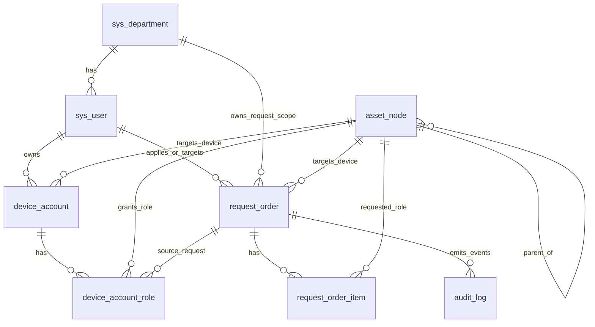

# AMS 2.0 ER Summary

## Core tables

### `sys_department`

- Department master data
- Referenced by `sys_user.department_id`
- Referenced by `request_order.applicant_department_id`
- Referenced by `request_order.target_department_id`

### `sys_user`

- User master data and login credentials
- Belongs to one department
- Referenced by `device_account.user_id`
- Referenced by `request_order.applicant_user_id`
- Referenced by `request_order.target_user_id`

### `asset_node`

- Hierarchical asset catalog
- Supports category, device, and role nodes
- Self-reference via `parent_id`
- Referenced by `device_account.device_node_id`
- Referenced by `device_account_role.role_node_id`
- Referenced by `request_order.target_device_node_id`

### `device_account`

- A user account on a specific device node
- Unique on `(user_id, device_node_id)`
- Parent for `device_account_role`

### `device_account_role`

- Role binding for a device account
- Unique on `(device_account_id, role_node_id)`
- Can point back to the workflow request that granted the role through `source_request_id`

### `request_order`

- Persisted request workflow record
- Stores applicant, target, device, snapshots, current status, current step, and timestamps
- Final workflow execution writes `finished_at`

### `request_order_item`

- Persisted workflow line items for the requested role nodes
- Belongs to one `request_order`
- Tracks the requested `role_node_id` and execution status

### `audit_log`

- Persisted audit/event log
- Stores action type, operator name, object type, object id, and creation time

## Relationship sketch

## Workflow mapping

- Request creation inserts one row into `request_order` and one or more rows into `request_order_item`.
- Approval transitions update `request_order.current_status` and `request_order.current_step`.
- Execution completion:
  - updates `request_order` to `COMPLETED`
  - stamps `finished_at`
  - marks `request_order_item.item_status`
  - inserts or updates `device_account_role`
  - writes an `audit_log` event

## Runtime assumptions

- `admin` is the default login for backend verification.
- Seeded device data includes one device and multiple role nodes.
- Request creation still targets pre-seeded reference data in local/test environments, but applicant, target, reason, and requested roles now come from the API payload.
